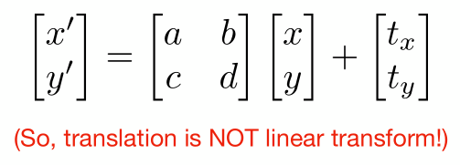
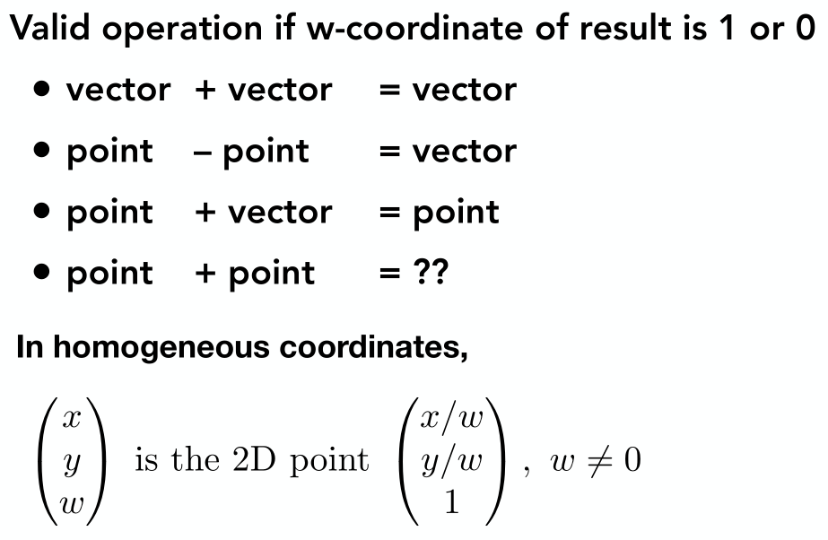
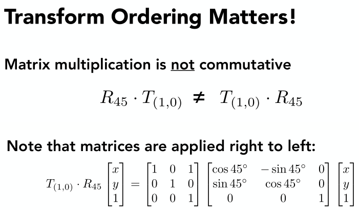
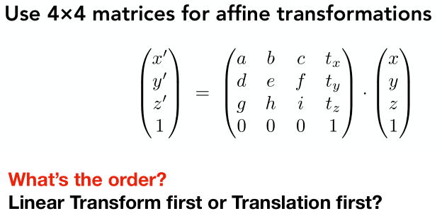

[toc]

> Notes For Lesson 01~04

# 01 Overview of Computer Graphics

Course Topics (mainly 4 parts)

- Rasterization
- Curves and Meshes
- Ray Tracing
- Animation / Simulation

# 02 Review of Linear Algebra

规定：课程中全是右手坐标系。应用右手螺旋。

## 向量

点乘的用途：

- 求投影

- 求夹角
- 判断方向的接近程度

叉乘的用途：

- 判定左右：看叉乘后z分量的正负，a叉乘b的z大于零，表示b在a的左侧。
- 判定点在三角形的内外：P点在AB向量、BC向量、CA向量的左侧，则在内部。

向量叉乘改为矩阵向量乘法的方法：

## 矩阵

2D reflection about y-axis

向量点乘、叉乘对应的矩阵形式

# 03 Transformation

## Contents

- Why study transformation
- 2D transformations: rotation, scale, shear
- Homogeneous coordinates
- Composing transforms
- 3D transformations

scale

shear

## rotation 推导

## Linear Transforms 

= Matrices(of the same dimension)

## Why Homogeneous Coordinates?

Translation cannot be represented in matrix form.

But we don't want translation to be as special case.

## Homogenous Coordinates

为啥向量的第三个坐标不是1？

答：向量具有平移不变性，所以添加的第三个坐标为0。另外，还保证了下述操作的正确性。

齐次坐标下，两个点相加的结果就是两个点的中点。

## Affine Transformations

仿射变换 = 线性变换 + 平移变换

**用齐次矩阵表示仿射变换**

## 2D Transformations

## Composing Transforms

## Decomposing Complex Transforms

## 3D Transforms

答案：仿射变换 = 线性变换 + 平移变换，先进行线性变换，再进行平移变换

类比2d空间下的情况，3d空间下也是一样哈。

