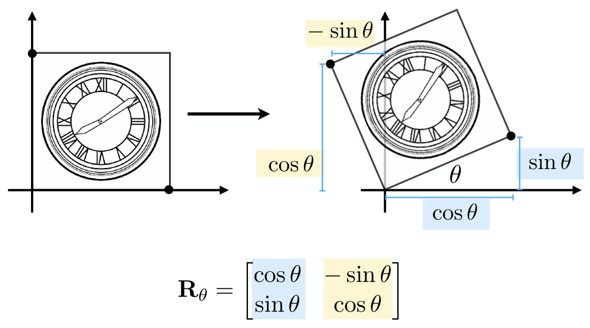
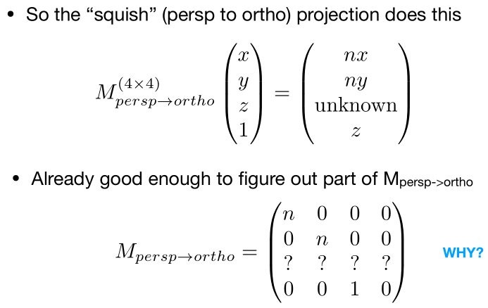

[toc]

> Notes For Lesson 01~04

# 01 Overview of Computer Graphics

Course Topics (mainly 4 parts)

- Rasterization
- Curves and Meshes
- Ray Tracing
- Animation / Simulation

# 02 Review of Linear Algebra

**规定：课程中全是右手坐标系。应用右手螺旋。**

## 向量

点乘的用途：

- 求投影

- 求夹角
- 判断方向的接近程度

叉乘的用途：

- 判定左右：看叉乘后z分量的正负，a叉乘b的z大于零，表示b在a的左侧。
- 判定点在三角形的内外：P点在AB向量、BC向量、CA向量的左侧，则在内部。

向量叉乘改为矩阵向量乘法的方法：

## 矩阵

2D reflection about y-axis

**向量点乘、叉乘对应的矩阵形式**

# 03 Transformation

## Contents

- Why study transformation
- 2D transformations: rotation, scale, shear
- Homogeneous coordinates
- Composing transforms
- 3D transformations

scale

shear

## rotation 推导

## Linear Transforms 

= Matrices(of the same dimension)

## Why Homogeneous Coordinates?

Translation cannot be represented in matrix form.

But we don't want translation to be as special case.

## Homogenous Coordinates

为啥向量的第三个坐标不是1？

答：向量具有平移不变性，所以添加的第三个坐标为0。另外，还保证了下述操作的正确性。

齐次坐标下，两个点相加的结果就是两个点的中点。

## Affine Transformations

仿射变换 = 线性变换 + 平移变换

**用齐次矩阵表示仿射变换**

## 2D Transformations

## Composing Transforms

## Decomposing Complex Transforms

## 3D Transforms

答案：仿射变换 = 线性变换 + 平移变换，先进行线性变换，再进行平移变换

类比2d空间下的情况，3d空间下也是一样哈。

# 04 Transformation Con.

## 旋转矩阵

上节课的补充：
旋转矩阵的逆 = 其转置，这类矩阵也称为正交矩阵。

## 本节内容

- 3D transformations
- Viewing transformation（观测矩阵）
  - view
  - projection
    - O
    - P

## 3D Transformations

### Scale

### Translate

### Rotation

先看下绕轴的旋转。

- y叉乘z得到x

- x叉乘y得到y

- z叉乘x得到y，所以是这样的。

再看下任意的旋转。

题外话：

四元数主要是用来进行旋转的插值。

## Viewing Transformation

### View  /  Camera Transformation （视图 / 相机变换）

Think about how to take a photo: model（选好位置，人们坐好）->view(摆放相机)->projection（按下快门）

### Projection transformation

- 3D to 2D
- Orthographic projection
- Perspective projection

#### Orthographic Projection

#### Perspective Projection

特点：近大远小；平行线不在平行

规定：

1. 近平面永远不变
2. 远平面z值还是f
3. 远平面中心不变

**推导“挤压”变换**

问题：中间部分的顶点的z值经过挤压是如何变化的？正中间的顶点是向前还是向后移动呢？

解答：

将中点(0,0,(n+f)/2,1)应用挤压变换得到新的顶点坐标为(0,0,(n2+f2)/(n+f),1)，

经过大小比较，新的顶点坐标的z坐标要大，所以是更接近近平面，属于向前移动。

至于其他的，听下节课？

 

